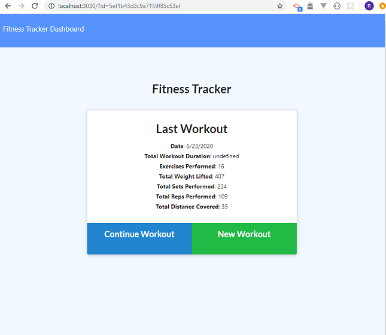
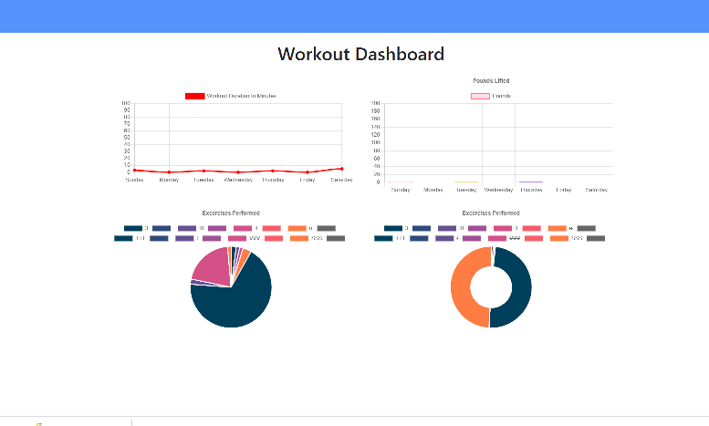

# Fitness_Tracker

## Description

Fitness_Tracker is a application for create and track daily workouts. and be able to log multiple exercises in a workout on a given day. Also be able to track the name, type, weight, sets, reps, and duration of exercise. 
____

##  Applications Uses in this projects
    * Node.js
    * Mongodb

## Instalation 

        $ npm install,
        $ npm install express,
        $ npm install gitignore,
        $ npm install mongoose,

## Pages  view



# Links to Project

#### GitHub
 [GitHub repository](https://github.com/RumaRDas/fitness_tracker.git)

### Run Server

```bash
node server.js
```
